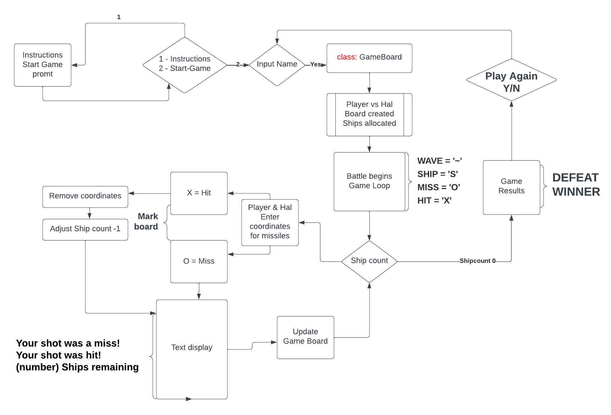
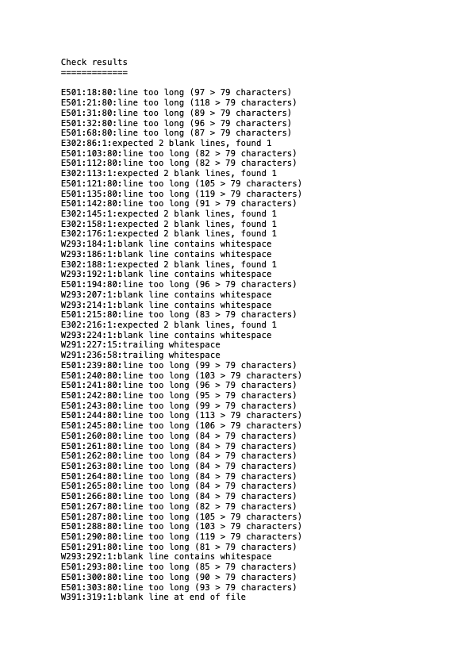

<h1 align="center">BATTLESHIP GAME</h1>

  <h3>
    <a href="https://battleshipcip3.herokuapp.com/">
      🌍 Heroku App
    </a>
     | 
    <a href="https://github.com/bslevin/BattleShipCIProject3">
      💾 Github Repository
    </a>
  </h3>

# How to play
  - Battleship is a two player game, here the computer (HAL) is the second player. Ships are randomly allocated on the board. When shooting at the other ship coordinates must be entered in a specific format. Letter for column and number for row with space between them. 
  - It is a 8 x 8 board, A,B,C,D,E,F,G,H and 0,1,2,3,4,5,6,7.
  - Game runs until one player is defeated

# Flowchart

# Features
  ## Of Game
  - Automatic ships placement
  - Gameplay player vs computer (HAL)
  - Artwork at game start
  - Game messages through out the game
  - Play in terminal and Heroku display console

  ## Existing Features
      - The computer's (HAl) ships are randomly placed on the board
      - Opponents ships are hidden from view
      - Missile coordinates are enterered by letter and number with a space inbetween 

  ## Future Features
      - Inputing coordinates of ship location
      - Exit game option

# Testing
  - This project has been tested doing the following;

  - Copied and ran code through PEP8
  - Tested all game input values and that they returned the corisponding warning texts
  - Tested on a laptop and a desktop terminal
  - Family tested on the Heroku display console

# Bugs
  - Code was orriginaly commited and pushed through VSCode on mac in another repository.[BattleShip2.0](https://github.com/bslevin/BattleShip2.0/commits/main)
      - When loading it into Heroku an apple.error came back. 
      - I then subsequently copied and pasted the code to this repository using gitpod. 
      - In this version most commits are for the read me.

  - PEP8 errors 

    
    <h2>(PEP8 errors none)</h2>

# Deployment

  <h2>Project was deployed using Heroku.</h2>
  
  - How to deploy:
    - Click 'create new app' in Heroku
    - Set choose buildbacks python and NodeJS in that order
    - Choose GitHub as your deployment method then click connect
    - Link your repository to Heroku by inputing your reopository name
    - Click on Deploy
  
  

  <h3>
      <a href="https://battleshipcip3.herokuapp.com/">
        🌍 Heroku App
      </a>
  </h3>
  

  <h3>
      <a href="https://github.com/bslevin/BattleShipCIProject3">
        💾 Github Repository
      </a>
  </h3>
  

# Credits

- Credit to a private mentor Diego Riemerez a tutuor on Preply for private classes.[Diego](https://preply.com/en/tutor/2632116)
- We built this on-line using live share on VSCode , learning python while coding.
- Youtube tutorials
  - [Python Intermediate Project Assignment: Learn How to make Battleships in under 15 minutes!](https://www.youtube.com/watch?v=MgJBgnsDcF0)
  - [Learn Python with CodeCademy: Battleship!](https://www.youtube.com/watch?v=7Ki_2gr0rsE)
  - [How to Code Battleship in Python - Single Player Game](https://www.youtube.com/watch?v=tF1WRCrd_HQ)
  - [Refactoring a Battleship Game in Python // Code Roast Part 1 of 2](https://www.youtube.com/watch?v=u3yo-TjeIDg)

# Resources

- [ASCII art archive](https://www.asciiart.eu/) code used in app artwork,
- [ASCII art generator](https://www.ascii-art-generator.org/) to make game message artwork,
- [Colorama](https://pypi.org/project/colorama/) For colorfull messages in terminal.
- [Lucidchart](https://lucid.app/) To create flowchart.
- [PEP8](http://pep8online.com/checkresult) For checking my code.
- [Heroku](https://dashboard.heroku.com/apps) for my application deployment,
